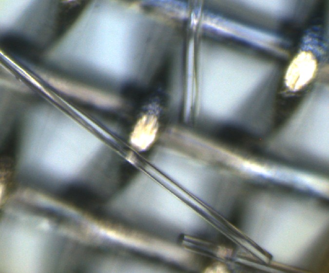

```{r setup, include=FALSE}
knitr::opts_chunk$set(echo = TRUE)
```

1.  Collect particle FTIR spectra and in a separate spreadsheet indicate morphology data for each particle. Glass fibers are consistently uncurved, smooth edged, translucent, and blunt ended (no taper) as shown in the images taken via FTIR below (Figure 1). We suggest using the sample and particle number as an index to join the spectra with the morphological information in step 3.

{width="314"}

2.  Process spectra through a particle identification library and create a subset of particles that are identified at mineral using a 0.7 hit quality index threshold.

3.  Join the mineral subset of spectra with the morphology data collected in step 1 and create a new subset of particles that have a mineral FTIR chemical identification and meet all morphology criteria (uncurved, smooth edges, blunt ended, and translucent).

4.  Process the raw spectra (no pre-processing) for the final subset of particles through the following screening to separate anthropogenic glass fibers from naturally occurring pennate diatoms

```{r, message=FALSE, warning=FALSE}
library(OpenSpecy)
library(plotly)

#where you read your data in, change the path to your data location or test with the example data provided
file <- "example_spectra/GF+D_mineral.zip" 

#loads the files in your zip folder, range = common fixes formatting issues
spectral_data <- read_any(file) |> c_spec(range = "common") 

#check to see that spectra are loaded.
plot(spectral_data)   
```

```{r}
#process spectra to remove carbon dioxide signal (flatten range command below) and to normalize spectra
processed <- process_spec(spectral_data,
                          active = TRUE,
                          adj_intens = FALSE,
                          adj_intens_args = list(type = "none"),
                          conform_spec = FALSE,
                          conform_spec_args = list(range = NULL, res = 8,
                                                   type = "interp"),
                          restrict_range = FALSE,
                          restrict_range_args = list(min = 0, max = 6000),
                          flatten_range = TRUE,
                          flatten_range_args = list(min = 2200, max = 2420),
                          subtr_baseline = FALSE,
                          subtr_baseline_args = list(type = "polynomial",
                                                     degree = 8, raw = FALSE,
                                                     baseline = NULL),
                          smooth_intens = FALSE,
                          smooth_intens_args = list(polynomial = 3, window = 11,
                                                    derivative = 0, abs = TRUE),
                          make_rel = TRUE) #normalize spectra
summary(processed)

```

```{r}
# Extract wavenumber vector and spectra matrix
wavenumbers <- processed$wavenumber
spectra_dt <- processed$spectra

# Identify index positions for the four regions
region_A_idx <- which(wavenumbers >= 1350 & wavenumbers <= 1450)
region_B_idx <- which(wavenumbers >= 1000 & wavenumbers <= 1100)
region_C_idx <- which(wavenumbers >=800 & wavenumbers <= 860)
region_D_idx <- which(wavenumbers >=1800 & wavenumbers <= 2100)

# Function to classify a single spectrum
classify_spectrum <- function(intensity_vec) {
  mean_A <- mean(intensity_vec[region_A_idx], na.rm = TRUE)
  mean_B <- mean(intensity_vec[region_B_idx], na.rm = TRUE)
  mean_C <- mean(intensity_vec[region_C_idx], na.rm = TRUE)
  mean_D <- mean(intensity_vec[region_D_idx], na.rm = TRUE)
  if (mean_B == 0 || is.na(mean_B)) {
    return("unknown")
  }
  if (mean_A > .25 * mean_B & mean_C > .5* mean_B ) { 
    return("GF")
  } 
  if (mean_A < .5 * mean_B & mean_D < .8* mean_B & mean_C < 0.7*mean_B) { 
    return("D")
  } 
  else {
    return("unknown")
  }
}

# Apply to each column (spectrum)
classification <- sapply(spectra_dt, classify_spectrum)

# Add classification to metadata
processed$metadata$classification <- classification

#table showing the classification results 
result_table <- processed$metadata %>%
  select(file_name, classification)

print(result_table)

```
The following code is useful for plotting the sample spectra to confirm the quality of the spectra and the identification 

```{r}
# Get column IDs of spectra classified as GF
gf_ids <- processed$metadata$col_id[processed$metadata$classification == "GF"]
unknown <- processed$metadata$col_id[processed$metadata$classification == "unknown"]
D_ids<- processed$metadata$col_id[processed$metadata$classification == "D"]
  
#Function to plot spectra
library(plotly)
library(htmltools)

plot_spectra_pages <- function(processed,
                               class_name = "GF",
                               plots_per_page = 9,
                               n_cols = 3,
                               page_break = c("html", "pdf", "none")) {
  
  page_break <- match.arg(page_break)
  
  # Pretty labels for plot/page titles
  class_labels <- c(
    "GF" = "Glass Fibers",
    "D" = "Diatoms",
    "unknown" = "Unknown"
  )
  
  plot_title <- if (class_name %in% names(class_labels)) {
    class_labels[[class_name]]
  } else {
    class_name
  }
  
  # Get IDs for selected classification
  ids <- processed$metadata$col_id[
    processed$metadata$classification == class_name
  ]
  
  if (length(ids) == 0) {
    message(paste("No spectra classified as", class_name))
    return(NULL)
  }
  
  # Create individual plots
  plots <- lapply(ids, function(id) {
    
    # Get file name for this spectrum
    file_label <- processed$metadata$file_name[
      processed$metadata$col_id == id
    ]
    
    plot_ly(
      x = processed$wavenumber,
      y = processed$spectra[[id]],
      type = "scatter",
      mode = "lines",
      name = file_label,
      hoverinfo = "text",
      text = paste("file:", file_label)
    ) %>%
      layout(
        title = list(text = file_label, x = 0.5, xanchor = "center"),
        xaxis = list(title = "Wavenumber (cm⁻¹)", autorange = "reversed"),
        yaxis = list(title = "Intensity")
      )
  })
  
  # Split into pages
  plot_groups <- split(plots, ceiling(seq_along(plots) / plots_per_page))
  
  # Page break helper
  page_break_tag <- function() {
    if (page_break == "html") {
      tags$div(style = "page-break-after: always;")
    } else if (page_break == "pdf") {
      HTML("\\newpage")
    } else {
      NULL
    }
  }
  
  # Build pages
  pages <- lapply(seq_along(plot_groups), function(i) {
    grp <- plot_groups[[i]]
    n_rows <- ceiling(length(grp) / n_cols)
    
    tagList(
      tags$h2(
        paste(plot_title, "- Page", i),
        style = "text-align:center; margin-bottom: 10px;"
      ),
      subplot(
        grp,
        nrows = n_rows,
        shareX = TRUE,
        shareY = TRUE,
        titleX = TRUE,
        titleY = TRUE
      ),
      if (i < length(plot_groups)) page_break_tag()
    )
  })
  
  browsable(tagList(pages))
}

#use this line to select the spectra to plot and the number of spectra per page. 
plot_spectra_pages(processed, "GF", plots_per_page = 6, n_cols = 2)

plot_spectra_pages(processed, "D", plots_per_page = 6, n_cols = 2)

plot_spectra_pages(processed, "unknown", plots_per_page = 6, n_cols = 2)

```

